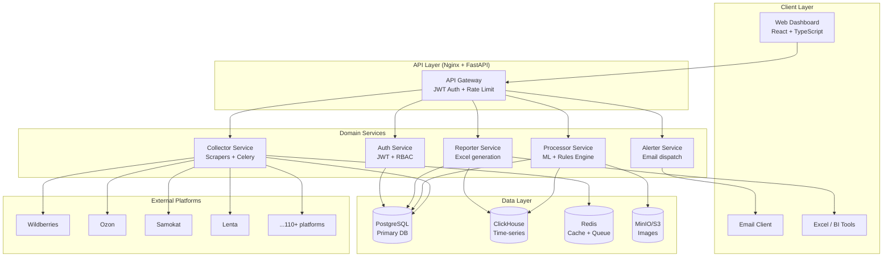

# CAT System Architecture

## Overview

**Style:** Distributed Monolith (Domain-Driven Monorepo)

A single codebase with clear domain boundaries: fast startup, simple testing, horizontal scalability without microservice complexity.

### System Diagram



---

## Technology Stack

| Layer | Technology | Version | Rationale |
|-------|-----------|---------|-----------|
| **Frontend** | React + TypeScript | 18+ | Industry standard |
| **UI** | Ant Design | 5.x | Rich components for tables and charts |
| **Charts** | Apache ECharts | 5.x | High performance |
| **Backend API** | FastAPI + Python | 3.11 | Async, OpenAPI docs, ML-friendly |
| **Task Queue** | Celery + Redis | 5.x | Distributed scraping tasks |
| **Scraping** | Playwright | Latest | JS-heavy sites (WB, Ozon) |
| **Scraping** | Scrapy | 2.x | High-volume structured scraping |
| **Primary DB** | PostgreSQL | 16 | ACID, JSONB, mature ecosystem |
| **Analytics DB** | ClickHouse | Latest | Time-series, fast aggregations |
| **Cache / Queue** | Redis | 7.x | Cache + Celery broker |
| **Image Storage** | MinIO (S3 API) | Latest | Self-hosted S3-compatible |
| **ML: Images** | CLIP via HuggingFace | Latest | Multilingual image-text embeddings |
| **ML: Text** | multilingual-e5 | Latest | Russian text embeddings |
| **ML: Sentiment** | rubert-base-cased-sentiment | Latest | Russian sentiment classification |
| **Excel Gen** | openpyxl | 3.x | Client-template Excel reports |
| **Auth** | python-jose + passlib | Latest | JWT + bcrypt |
| **Reverse Proxy** | Nginx | Latest | SSL, static files, routing |
| **Migrations** | Alembic | Latest | PostgreSQL schema migrations |

---

## System Components

### API Service (`services/api/`)

FastAPI application implementing the REST API. Split into domains following DDD:

| Domain | Path | Responsibility |
|--------|------|---------------|
| `auth` | `/api/v1/auth/` | JWT, users, RBAC |
| `content` | `/api/v1/content/` | Content scores, references |
| `stock` | `/api/v1/stock/` | Distribution, plan vs actual |
| `reviews` | `/api/v1/reviews/` | Reviews, sentiment |
| `prices` | `/api/v1/prices/` | Price monitoring |
| `reports` | `/api/v1/reports/` | Excel export |
| `alerts` | `/api/v1/alerts/` | Alert config and delivery |

Each domain contains: `models.py` (ORM), `schemas.py` (Pydantic), `service.py` (business logic), `repository.py` (DB queries), `router.py` (FastAPI routes).

### Collector Service (`services/collector/`)

Celery workers running scrapers. The `BaseScraper` base class defines:
- `collect_content()`, `collect_stock()`, `collect_reviews()`, `collect_price()`
- `rate_limit` — request frequency per platform
- `with_retry()` — exponential backoff (up to 3 retries)
- `with_proxy()` — proxy rotation

Scrapers use Playwright for JS-heavy sites and Scrapy for high-volume parsing.

### Processor Service (`services/processor/`)

ML pipeline on Celery:

**Content Scoring:**
```
Content Total = 0.40 × image_clip_cosine_sim
              + 0.35 × desc_e5_cosine_sim
              + 0.25 × comp_e5_cosine_sim
```
Reference embeddings are cached in Redis when a reference is uploaded.

**Sentiment Pipeline:**
- Model: `rubert-base-cased-sentiment`
- Batch size: 32 reviews
- Output: `{positive, negative, neutral}` + score

---

## Data Model (Key Entities)

```
organizations (multi-tenancy root)
  └── users (admin | manager | viewer)
  └── brands (client | competitor)
       └── skus (articles with reference materials)
            └── sku_platforms (SKU × platform)
                 ├── content_scores (daily)
                 ├── price_snapshots
                 └── reviews
distribution_plans (store count plan per SKU × platform)
alert_configs → alert_events
```

**Time-series in ClickHouse:**
- `price_history` — price history (partitioned by month)
- `stock_history` — stock by city and address
- `content_score_history` — content score dynamics

---

## Security

### Authentication

```
POST /login → JWT (15 min) + Refresh token (7 days)
POST /refresh → new JWT
```

### Multi-Tenant Isolation

**Every SQL query is filtered by `org_id`.** PostgreSQL RLS is the last line of defense.

### RBAC

| Role | Permissions |
|------|-------------|
| `admin` | Everything + user management |
| `manager` | CRUD SKUs, view, export, alerts |
| `viewer` | Read-only, export |

### Secrets Management

- All secrets in `.env` (never in code)
- Startup validation: missing secret → `sys.exit(1)`
- JWT_SECRET: no fallback defaults
- S3 images: private access only, presigned URLs expire in 1 hour

---

## Scalability

| Stage | Configuration | Capacity |
|-------|--------------|---------|
| MVP | 1 VPS, Docker Compose | 5–10 platforms, 10K SKUs |
| Growth | 1 VPS, scale replicas | 50 platforms, 100K SKUs |
| Scale | 2+ VPS, external DB | 110+ platforms, 1M SKUs |
| Enterprise | K8s ready | Unlimited |

Horizontal scaling:
```bash
docker compose up --scale collector=4 --scale processor=2
```

> **Constraint:** `beat` (Celery Beat scheduler) must always run as **exactly 1 replica**. Multiple Beat replicas = duplicate tasks.
