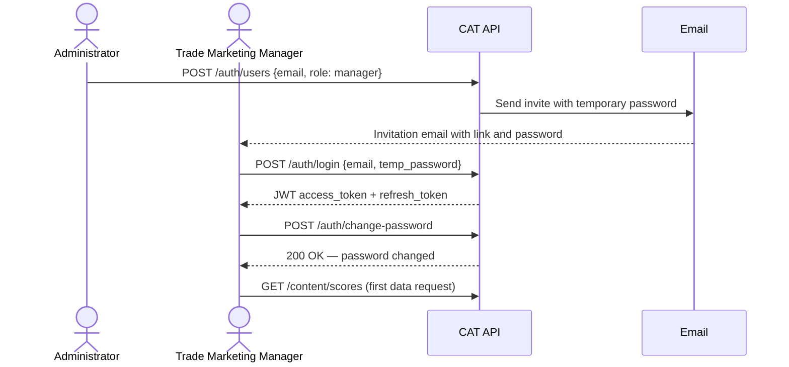
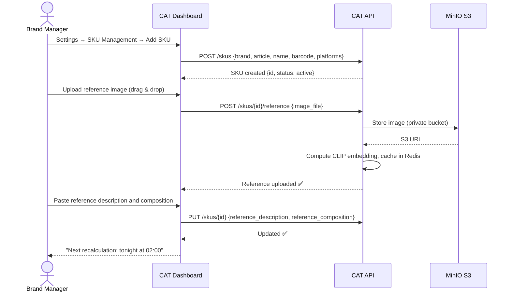
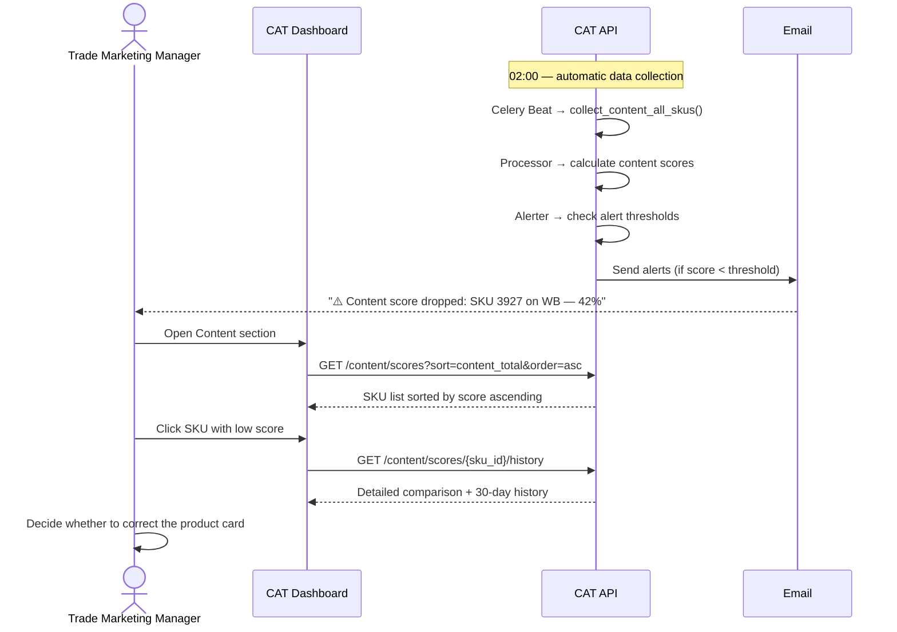
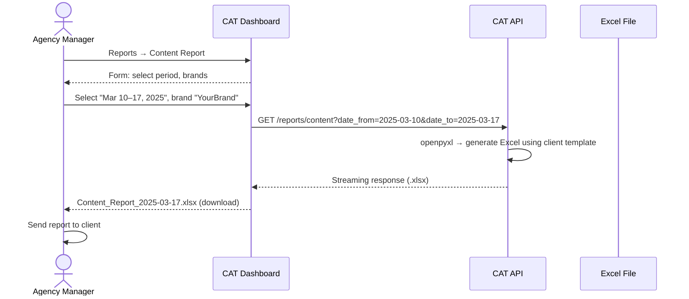
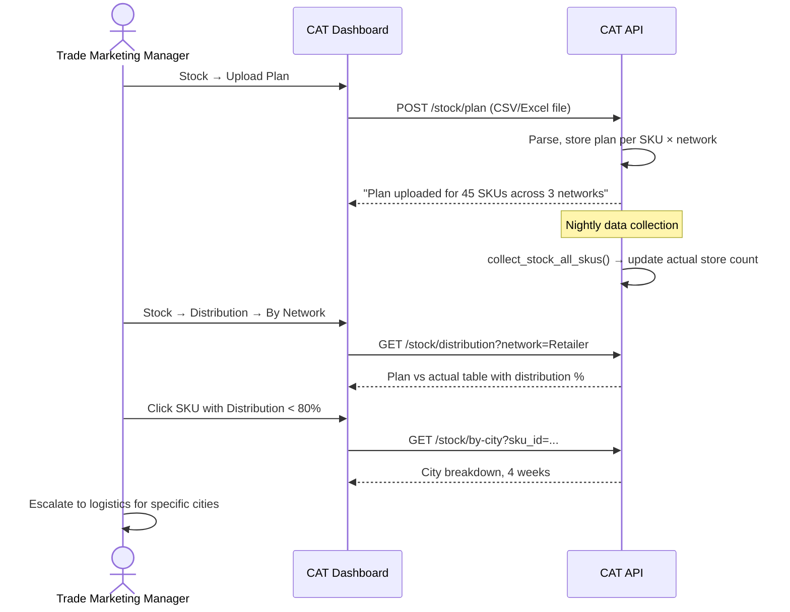
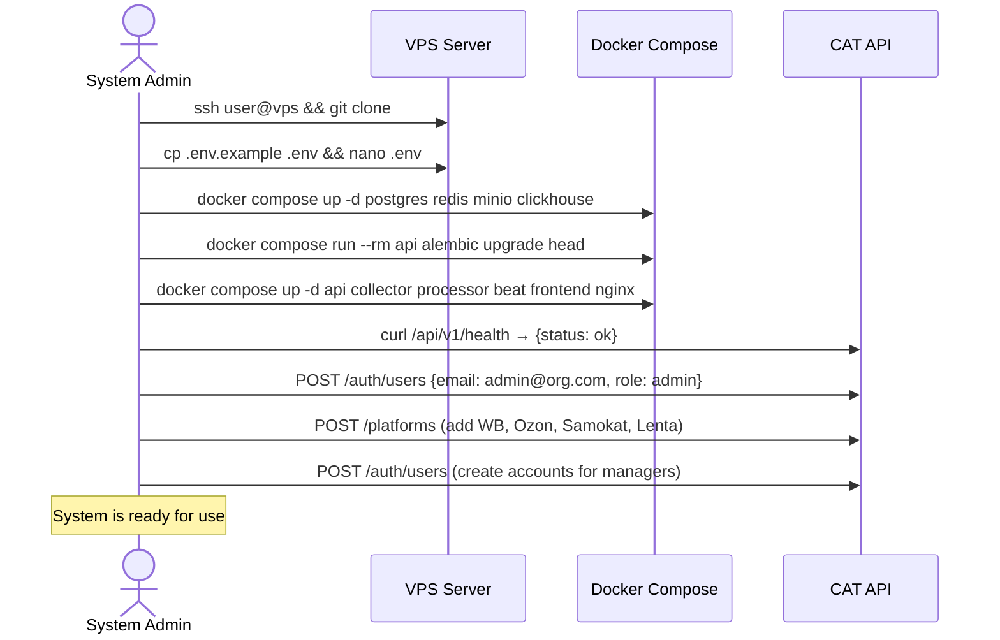
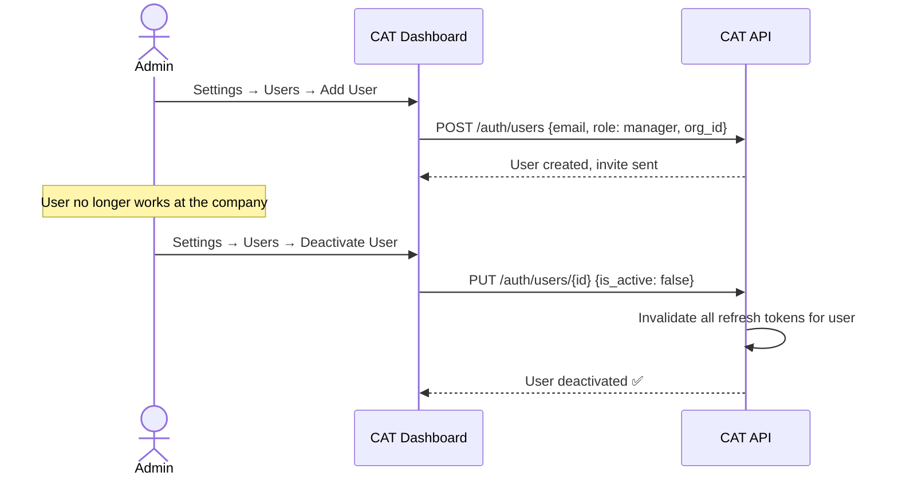
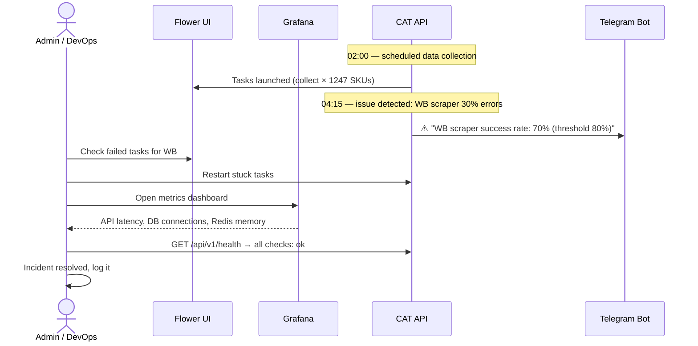

# CAT User & Admin Flows

## User Flow: Registration and First Login

**Steps:**
1. Administrator creates an account via Settings → Users
2. User receives an email with a temporary password
3. First login → change password → access dashboard

---

## User Flow: Add SKU and Upload Reference

**What happens under the hood:**
- CLIP embedding of the reference image is cached immediately
- multilingual-e5 text embedding is cached immediately
- Content score will be recalculated in the next nightly cycle (02:00)

---

## User Flow: Daily Content Monitoring

---

## User Flow: Export Content Report for Client

---

## User Flow: Check Distribution Plan vs Actual

---

## Admin Flow: Initial System Setup

---

## Admin Flow: User Management

---

## Admin Flow: System Health Monitoring

