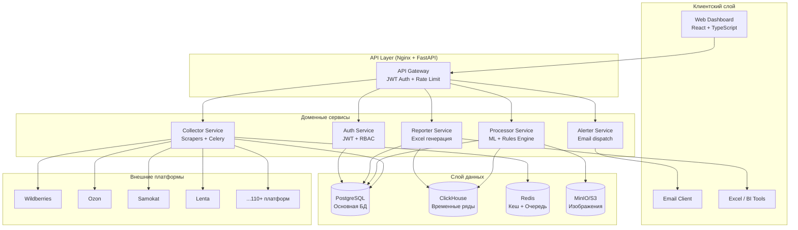

# Архитектура системы CAT

## Обзор

**Стиль:** Distributed Monolith (Domain-Driven Monorepo)

Единая кодовая база с чёткими границами доменов: быстрый старт, простое тестирование, горизонтальное масштабирование без сложности микросервисов.

### Диаграмма системы



---

## Технологический стек

| Слой | Технология | Версия | Обоснование |
|------|-----------|--------|-------------|
| **Frontend** | React + TypeScript | 18+ | Industry standard |
| **UI** | Ant Design | 5.x | Богатые компоненты для таблиц и графиков |
| **Charts** | Apache ECharts | 5.x | Высокая производительность |
| **Backend API** | FastAPI + Python | 3.11 | Async, автодокументация OpenAPI, ML-friendly |
| **Task Queue** | Celery + Redis | 5.x | Распределённые scraping-задачи |
| **Scraping** | Playwright | Latest | JS-тяжёлые сайты (WB, Ozon) |
| **Scraping** | Scrapy | 2.x | Высокообъёмный структурный scraping |
| **Primary DB** | PostgreSQL | 16 | ACID, JSONB, зрелая экосистема |
| **Analytics DB** | ClickHouse | Latest | Временные ряды, быстрые агрегации |
| **Cache / Queue** | Redis | 7.x | Кеш + брокер Celery |
| **Image Storage** | MinIO (S3 API) | Latest | Self-hosted S3-compatible |
| **ML: Images** | CLIP via HuggingFace | Latest | Мультиязычные image-text embeddings |
| **ML: Text** | multilingual-e5 | Latest | Русские текстовые embeddings |
| **ML: Sentiment** | rubert-base-cased-sentiment | Latest | Анализ тональности на русском |
| **Excel Gen** | openpyxl | 3.x | Генерация Excel-отчётов по шаблонам клиента |
| **Auth** | python-jose + passlib | Latest | JWT токены + bcrypt |
| **Reverse Proxy** | Nginx | Latest | SSL, статика, маршрутизация |
| **Migrations** | Alembic | Latest | PostgreSQL схема-миграции |

---

## Компоненты системы

### API Service (`services/api/`)

FastAPI-приложение, реализующее REST API. Разбито на домены по принципу Domain-Driven Design:

| Домен | Путь | Ответственность |
|-------|------|----------------|
| `auth` | `/api/v1/auth/` | JWT, пользователи, RBAC |
| `content` | `/api/v1/content/` | Content scores, эталоны |
| `stock` | `/api/v1/stock/` | Дистрибуция, план/факт |
| `reviews` | `/api/v1/reviews/` | Отзывы, sentiment |
| `prices` | `/api/v1/prices/` | Ценовой мониторинг |
| `reports` | `/api/v1/reports/` | Excel-экспорт |
| `alerts` | `/api/v1/alerts/` | Конфигурация и отправка алертов |

Каждый домен содержит: `models.py` (ORM), `schemas.py` (Pydantic), `service.py` (бизнес-логика), `repository.py` (запросы к БД), `router.py` (FastAPI роуты).

### Collector Service (`services/collector/`)

Celery-воркеры, запускающие scrapers. Базовый класс `BaseScraper` определяет:
- `collect_content()`, `collect_stock()`, `collect_reviews()`, `collect_price()`
- `rate_limit` — частота запросов к конкретной платформе
- `with_retry()` — экспоненциальный backoff (до 3 попыток)
- `with_proxy()` — ротация прокси

Scraper'ы используют Playwright для JS-тяжёлых сайтов и Scrapy для высокообъёмного парсинга.

### Processor Service (`services/processor/`)

ML-пайплайн на Celery:

**Content Scoring:**
```
Content Total = 0.40 × image_clip_cosine_sim
              + 0.35 × desc_e5_cosine_sim
              + 0.25 × comp_e5_cosine_sim
```
Reference embeddings кешируются в Redis при загрузке эталона.

**Sentiment Pipeline:**
- Модель: `rubert-base-cased-sentiment`
- Батч: 32 отзыва за раз
- Вывод: `{positive, negative, neutral}` + score

---

## Модель данных (ключевые сущности)

```
organizations (мультитенантность)
  └── users (admin | manager | viewer)
  └── brands (client | competitor)
       └── skus (артикулы с reference materials)
            └── sku_platforms (SKU × платформа)
                 ├── content_scores (daily)
                 ├── price_snapshots
                 └── reviews
distribution_plans (план ТТ по SKU × платформа)
alert_configs → alert_events
```

**Временные ряды в ClickHouse:**
- `price_history` — история цен (партиционирование по месяцу)
- `stock_history` — остатки по городам и адресам
- `content_score_history` — динамика контент-оценки

---

## Безопасность

### Аутентификация

```
POST /login → JWT (15 мин) + Refresh token (7 дней)
POST /refresh → новый JWT
```

### Multi-tenant изоляция

**Каждый SQL-запрос фильтруется по `org_id`.** PostgreSQL RLS — последняя линия защиты.

### RBAC

| Роль | Права |
|------|-------|
| `admin` | Всё + управление пользователями |
| `manager` | CRUD SKU, просмотр, экспорт, алерты |
| `viewer` | Только чтение, экспорт |

### Secrets Management

- Все секреты в `.env` (не в коде)
- Проверка при старте: если отсутствует → `sys.exit(1)`
- JWT_SECRET: без fallback-дефолтов
- S3-изображения: только private access, presigned URL на 1 час

---

## Масштабируемость

| Этап | Конфигурация | Ёмкость |
|------|-------------|---------|
| MVP | 1 VPS, Docker Compose | 5–10 платформ, 10K SKU |
| Growth | 1 VPS, scale replicas | 50 платформ, 100K SKU |
| Scale | 2+ VPS, external DB | 110+ платформ, 1M SKU |
| Enterprise | K8s ready | Без ограничений |

Горизонтальное масштабирование:
```bash
docker compose up --scale collector=4 --scale processor=2
```

> **Ограничение:** `beat` (Celery Beat scheduler) всегда запускается в **1 реплике**. Несколько реплик Beat = дублирование задач.
