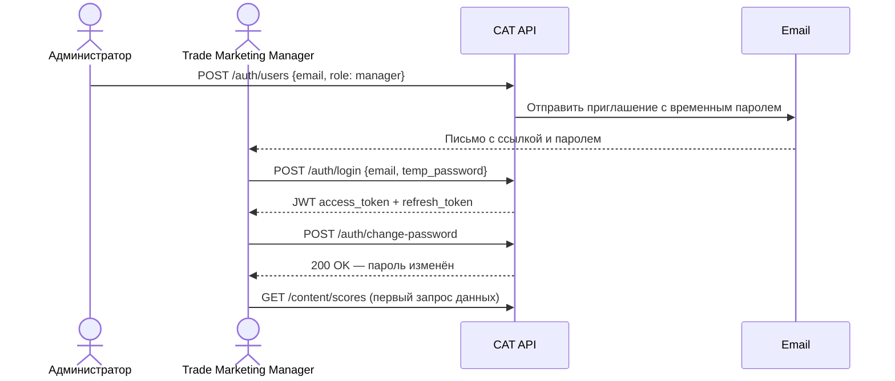
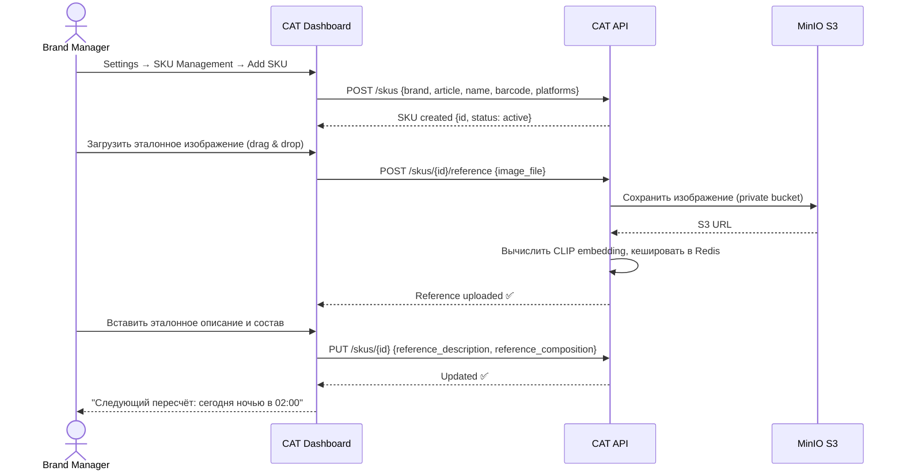
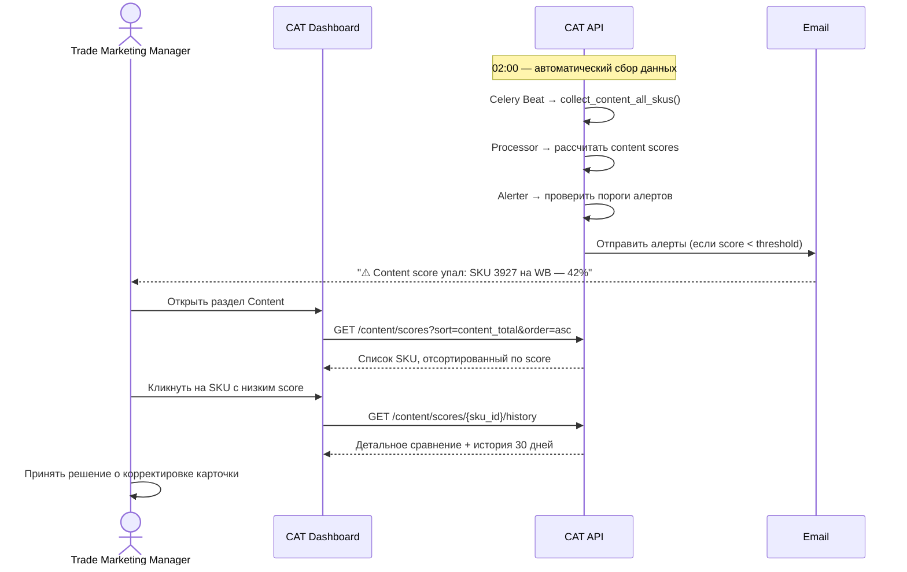
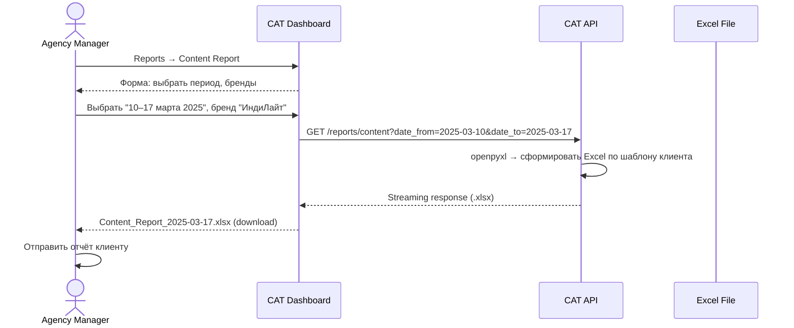
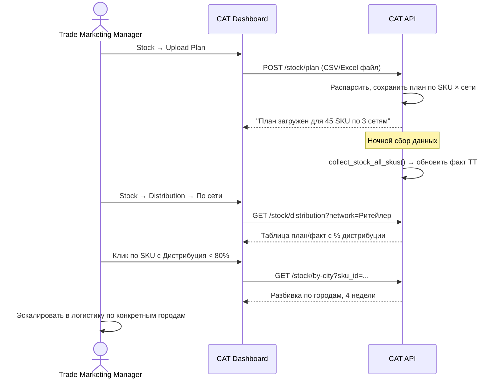
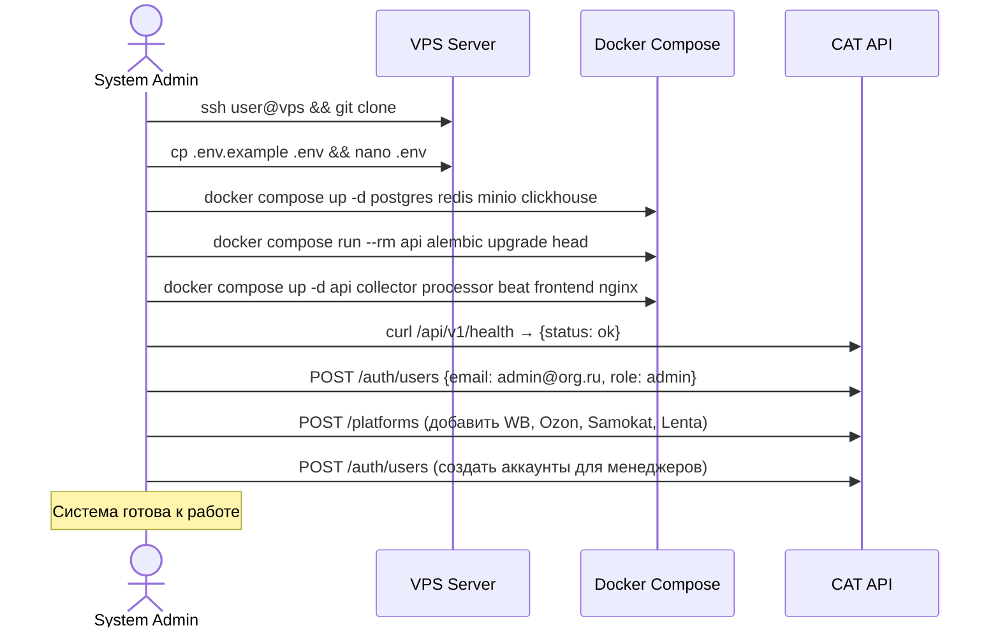
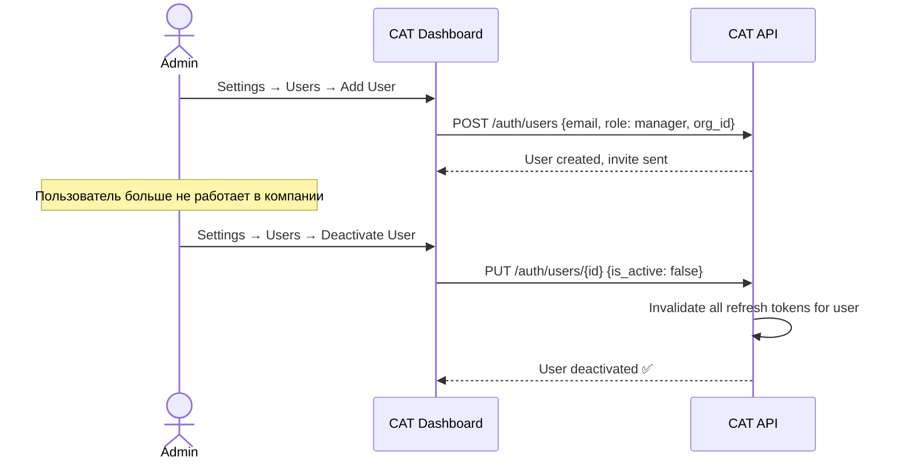
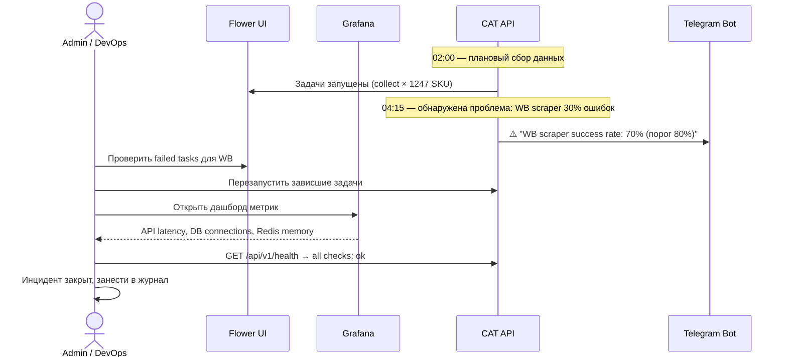

# Пользовательские сценарии CAT

## User Flow: Регистрация и первый вход

**Шаги:**
1. Администратор создаёт аккаунт через Settings → Users
2. Пользователь получает email с временным паролем
3. Первый вход → смена пароля → доступ к дашборду

---

## User Flow: Добавление SKU и загрузка эталона

**Что происходит «под капотом»:**
- CLIP-embedding эталонного изображения кешируется немедленно
- multilingual-e5 embedding текста кешируется немедленно
- Content score будет пересчитан в ближайший ночной цикл (02:00)

---

## User Flow: Ежедневный мониторинг контента

---

## User Flow: Экспорт Content Report для клиента

---

## User Flow: Проверка дистрибуции план/факт

---

## Admin Flow: Настройка системы (первоначальная)

---

## Admin Flow: Управление пользователями организации

---

## Admin Flow: Мониторинг состояния системы

