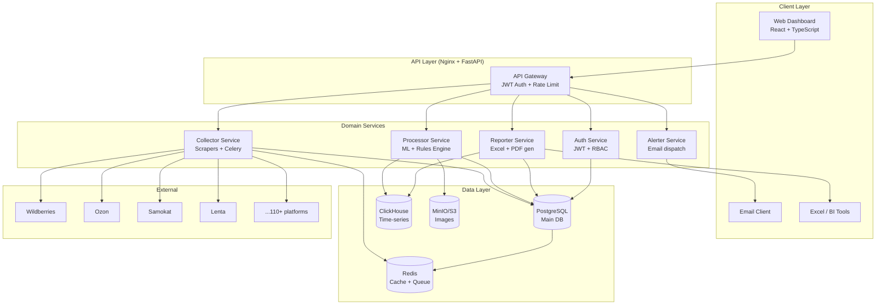

# Architecture — Commerce Analytics Tool (CAT)

> **SPARC Phase 5: Architecture** | Distributed Monolith in Monorepo | Docker + Docker Compose | VPS

---

## 1. Architecture Overview

**Style:** Distributed Monolith (Domain-Driven Monorepo)
**Rationale:** Единая кодовая база с чёткими границами доменов позволяет быстро стартовать, легко тестировать и без сложности микросервисов масштабироваться при необходимости.

```
┌─────────────────────────────────────────────────────────────────────────────┐
│                          CAT SYSTEM ARCHITECTURE                             │
│                                                                              │
│  ┌──────────────────────────────────────────────────────────────────────┐   │
│  │  CLIENT LAYER                                                         │   │
│  │  ┌─────────────────┐  ┌─────────────────┐  ┌─────────────────────┐  │   │
│  │  │  Web App (React)│  │   Excel Reports  │  │   Email Alerts      │  │   │
│  │  │  /dashboard     │  │   .xlsx export   │  │   SMTP/Postfix      │  │   │
│  │  └────────┬────────┘  └────────┬─────────┘  └──────────┬──────────┘  │   │
│  └───────────┼───────────────────-┼─────────────────────--┼─────────────┘   │
│              │                    │                         │                 │
│  ┌───────────▼────────────────────▼─────────────────────--▼─────────────┐   │
│  │  API GATEWAY (FastAPI + Nginx)                                         │   │
│  │  JWT Auth | Rate Limiting | CORS | Request Routing                    │   │
│  └─────┬──────────┬──────────┬──────────┬──────────┬──────────┬─────────┘   │
│        │          │          │          │          │          │               │
│  ┌─────▼──┐ ┌────▼───┐ ┌───▼────┐ ┌──▼─────┐ ┌─▼──────┐ ┌─▼─────────┐   │
│  │CONTENT │ │ STOCK  │ │REVIEWS │ │ PRICES │ │ALERTER │ │ REPORTER  │   │
│  │Service │ │Service │ │Service │ │Service │ │Service │ │  Service  │   │
│  └───┬────┘ └───┬────┘ └───┬────┘ └───┬────┘ └───┬────┘ └──────┬────┘   │
│      │          │          │          │          │               │           │
│  ┌───▼──────────▼──────────▼──────────▼──────────▼───────────-──▼──────┐   │
│  │  COLLECTOR SERVICE (Scraping Orchestrator)                            │   │
│  │  ┌──────────┐ ┌──────────┐ ┌──────────┐ ┌──────────┐ ┌──────────┐  │   │
│  │  │WB Scraper│ │OZ Scraper│ │SK Scraper│ │LN Scraper│ │  N+...   │  │   │
│  │  └──────────┘ └──────────┘ └──────────┘ └──────────┘ └──────────┘  │   │
│  │  Celery Tasks + Redis Queue + Playwright/Scrapy                      │   │
│  └─────────────────────────────────────────────────────────────────────┘   │
│                                                                              │
│  ┌───────────────────────── DATA LAYER ───────────────────────────────────┐ │
│  │ PostgreSQL (main) │ ClickHouse (analytics) │ Redis (cache/queue)       │ │
│  │ MinIO/S3 (images) │ ElasticSearch (reviews search - optional)          │ │
│  └────────────────────────────────────────────────────────────────────────┘ │
└─────────────────────────────────────────────────────────────────────────────┘
```

---

## 2. High-Level C4 Diagram (Mermaid)



---

## 3. Monorepo Structure

```
cat-clone/
├── docker-compose.yml              # Orchestration
├── docker-compose.prod.yml         # Production overrides
├── .env.example                    # Environment template
├── Makefile                        # Dev shortcuts
│
├── services/
│   ├── api/                        # FastAPI backend
│   │   ├── app/
│   │   │   ├── main.py
│   │   │   ├── auth/               # JWT, users, RBAC
│   │   │   ├── content/            # Content scoring domain
│   │   │   ├── stock/              # Distribution domain
│   │   │   ├── reviews/            # Reviews domain
│   │   │   ├── prices/             # Price monitoring domain
│   │   │   ├── reports/            # Excel generation
│   │   │   ├── alerts/             # Email alerts
│   │   │   └── core/               # DB, config, deps
│   │   ├── Dockerfile
│   │   └── requirements.txt
│   │
│   ├── collector/                  # Scraping service
│   │   ├── app/
│   │   │   ├── celery_app.py       # Celery entrypoint
│   │   │   ├── scrapers/
│   │   │   │   ├── base.py         # Abstract scraper
│   │   │   │   ├── wildberries.py
│   │   │   │   ├── ozon.py
│   │   │   │   ├── samokat.py
│   │   │   │   ├── lenta.py
│   │   │   │   └── ...             # 110+ scrapers
│   │   │   ├── tasks/
│   │   │   │   ├── content_task.py
│   │   │   │   ├── stock_task.py
│   │   │   │   ├── reviews_task.py
│   │   │   │   └── prices_task.py
│   │   │   └── proxy/              # Proxy rotation
│   │   ├── Dockerfile
│   │   └── requirements.txt
│   │
│   ├── processor/                  # ML processing service
│   │   ├── app/
│   │   │   ├── content_scorer.py   # Image + text similarity
│   │   │   ├── sentiment.py        # Reviews NLP
│   │   │   ├── anomaly.py          # Price anomaly detection
│   │   │   └── models/             # Model weights
│   │   ├── Dockerfile
│   │   └── requirements.txt
│   │
│   └── frontend/                   # React app
│       ├── src/
│       │   ├── pages/
│       │   │   ├── Dashboard/
│       │   │   ├── Content/
│       │   │   ├── Stock/
│       │   │   ├── Reviews/
│       │   │   ├── Prices/
│       │   │   └── Settings/
│       │   ├── components/
│       │   └── api/
│       ├── Dockerfile
│       └── package.json
│
├── infrastructure/
│   ├── nginx/                      # Reverse proxy config
│   ├── postgres/                   # DB migrations (Alembic)
│   ├── clickhouse/                 # CH schema
│   └── redis/                      # Redis config
│
└── docs/                           # SPARC documentation (this)
```

---

## 4. Technology Stack

| Layer | Technology | Version | Rationale |
|-------|------------|---------|-----------|
| **Frontend** | React + TypeScript | 18+ | Industry standard, large ecosystem |
| **UI Library** | Ant Design | 5.x | Rich data-heavy components (Tables, Charts) |
| **Charts** | Apache ECharts | 5.x | High-performance, Russia-friendly |
| **Backend API** | FastAPI + Python | 3.11 | Async, automatic OpenAPI, ML-friendly |
| **Task Queue** | Celery + Redis | 5.x | Distributed scraping tasks |
| **Scraping** | Playwright | Latest | JS-heavy sites (WB, Ozon) |
| **Scraping** | Scrapy | 2.x | High-volume structured scraping |
| **Primary DB** | PostgreSQL | 16 | ACID, JSONB, mature ecosystem |
| **Analytics DB** | ClickHouse | Latest | Time-series, fast aggregations |
| **Cache / Queue** | Redis | 7.x | Fast cache + Celery broker |
| **Image Storage** | MinIO (S3 API) | Latest | Self-hosted S3-compatible |
| **ML: Images** | CLIP (OpenAI) via HuggingFace | Latest | Multilingual image-text embeddings |
| **ML: Text** | ruBERT / multilingual-e5 | Latest | Russian text embeddings |
| **ML: Sentiment** | rubert-base-cased-sentiment | Latest | Russian sentiment classification |
| **Excel Gen** | openpyxl | 3.x | Excel report generation (matches templates) |
| **Email** | FastMail / SMTP | — | Alert delivery |
| **Reverse Proxy** | Nginx | Latest | SSL termination, static files, routing |
| **Containerization** | Docker + Compose | Latest | VPS deployment |
| **Migrations** | Alembic | Latest | PostgreSQL schema migrations |
| **Auth** | python-jose + passlib | Latest | JWT tokens |

---

## 5. Database Schema

### PostgreSQL (Main)

```sql
-- Multi-tenant
CREATE TABLE organizations (
    id UUID PRIMARY KEY,
    name VARCHAR(255) NOT NULL,
    slug VARCHAR(100) UNIQUE NOT NULL,
    plan VARCHAR(50) DEFAULT 'basic',
    created_at TIMESTAMPTZ DEFAULT NOW()
);

CREATE TABLE users (
    id UUID PRIMARY KEY,
    org_id UUID REFERENCES organizations(id),
    email VARCHAR(255) UNIQUE NOT NULL,
    password_hash VARCHAR(255) NOT NULL,
    role VARCHAR(50) DEFAULT 'user', -- admin, manager, viewer
    created_at TIMESTAMPTZ DEFAULT NOW()
);

-- SKU catalog
CREATE TABLE brands (
    id UUID PRIMARY KEY,
    org_id UUID REFERENCES organizations(id),
    name VARCHAR(255) NOT NULL,
    type VARCHAR(50) DEFAULT 'client' -- client | competitor
);

CREATE TABLE skus (
    id UUID PRIMARY KEY,
    org_id UUID REFERENCES organizations(id),
    brand_id UUID REFERENCES brands(id),
    article VARCHAR(100),
    rpc VARCHAR(100), -- retail product code
    name VARCHAR(500) NOT NULL,
    barcode VARCHAR(50),
    category VARCHAR(255),
    sub_category VARCHAR(255),
    reference_image_url TEXT, -- S3 URL
    reference_description TEXT,
    reference_composition TEXT,
    is_active BOOLEAN DEFAULT TRUE,
    created_at TIMESTAMPTZ DEFAULT NOW()
);

-- Platforms
CREATE TABLE platforms (
    id UUID PRIMARY KEY,
    name VARCHAR(100) NOT NULL, -- "Samokat_APP", "Wildberries", etc.
    type VARCHAR(50), -- marketplace | darkstore | retailer
    scraper_module VARCHAR(100),
    schedule_cron VARCHAR(50) DEFAULT '0 2 * * *',
    is_active BOOLEAN DEFAULT TRUE
);

CREATE TABLE sku_platforms (
    id UUID PRIMARY KEY,
    sku_id UUID REFERENCES skus(id),
    platform_id UUID REFERENCES platforms(id),
    external_id VARCHAR(255), -- platform-specific ID
    url TEXT,
    is_monitored BOOLEAN DEFAULT TRUE,
    UNIQUE(sku_id, platform_id)
);

-- Content scores
CREATE TABLE content_scores (
    id UUID PRIMARY KEY,
    sku_platform_id UUID REFERENCES sku_platforms(id),
    scored_at DATE NOT NULL,
    content_total DECIMAL(5,2), -- 0-100%
    image_front DECIMAL(5,2),
    description_score DECIMAL(5,2),
    composition_score DECIMAL(5,2),
    collected_image_url TEXT,
    collected_description TEXT,
    collected_composition TEXT,
    UNIQUE(sku_platform_id, scored_at)
);

-- Distribution plan
CREATE TABLE distribution_plans (
    id UUID PRIMARY KEY,
    sku_id UUID REFERENCES skus(id),
    platform_id UUID REFERENCES platforms(id),
    group_name VARCHAR(100), -- "Фреш", "МКИ", "Заморозка"
    plan_tt_count INTEGER,
    week_number INTEGER,
    year INTEGER,
    UNIQUE(sku_id, platform_id, week_number, year)
);

-- Reviews
CREATE TABLE reviews (
    id UUID PRIMARY KEY,
    sku_platform_id UUID REFERENCES sku_platforms(id),
    review_text TEXT,
    rating SMALLINT CHECK (rating BETWEEN 1 AND 5),
    sentiment VARCHAR(20), -- positive | negative | neutral
    sentiment_score DECIMAL(4,3),
    review_date DATE,
    collected_at TIMESTAMPTZ DEFAULT NOW(),
    external_review_id VARCHAR(255),
    UNIQUE(sku_platform_id, external_review_id)
);

-- Price history (also in ClickHouse for fast aggregation)
CREATE TABLE price_snapshots (
    id UUID PRIMARY KEY,
    sku_platform_id UUID REFERENCES sku_platforms(id),
    price DECIMAL(10,2),
    original_price DECIMAL(10,2),
    discount_pct DECIMAL(5,2),
    promo_label VARCHAR(255),
    collected_at TIMESTAMPTZ NOT NULL
);

-- Alerts
CREATE TABLE alert_configs (
    id UUID PRIMARY KEY,
    org_id UUID REFERENCES organizations(id),
    sku_id UUID REFERENCES skus(id), -- NULL = all SKUs
    platform_id UUID REFERENCES platforms(id), -- NULL = all platforms
    alert_type VARCHAR(50), -- content_drop | price_change | competitor_promo | oos
    threshold DECIMAL(10,2),
    email_recipients TEXT[], -- array of emails
    is_active BOOLEAN DEFAULT TRUE
);

CREATE TABLE alert_events (
    id UUID PRIMARY KEY,
    config_id UUID REFERENCES alert_configs(id),
    sku_platform_id UUID REFERENCES sku_platforms(id),
    triggered_at TIMESTAMPTZ DEFAULT NOW(),
    alert_type VARCHAR(50),
    value_before DECIMAL(10,2),
    value_after DECIMAL(10,2),
    is_sent BOOLEAN DEFAULT FALSE,
    sent_at TIMESTAMPTZ
);
```

### ClickHouse (Time-Series Analytics)

```sql
CREATE TABLE price_history (
    date Date,
    sku_id UUID,
    platform_id UUID,
    org_id UUID,
    price Float64,
    discount_pct Float32,
    collected_at DateTime
) ENGINE = MergeTree()
PARTITION BY toYYYYMM(date)
ORDER BY (org_id, sku_id, platform_id, date);

CREATE TABLE stock_history (
    date Date,
    sku_id UUID,
    platform_id UUID,
    org_id UUID,
    city VARCHAR(100),
    address_id VARCHAR(255),
    stock_count UInt32,
    week_number UInt8,
    year UInt16
) ENGINE = MergeTree()
PARTITION BY toYYYYMM(date)
ORDER BY (org_id, sku_id, platform_id, date);

CREATE TABLE content_score_history (
    date Date,
    sku_id UUID,
    platform_id UUID,
    org_id UUID,
    content_total Float32,
    image_front Float32,
    description_score Float32,
    composition_score Float32
) ENGINE = MergeTree()
PARTITION BY toYYYYMM(date)
ORDER BY (org_id, sku_id, platform_id, date);
```

---

## 6. ML Architecture

### Content Scoring Pipeline

```
Reference Image (S3) ──→ CLIP Encoder ──→ Reference Embedding (cached)
                                                     │
Collected Image (S3) ──→ CLIP Encoder ──→ Collected Embedding ──→ Cosine Similarity → Image Score

Reference Description ──→ multilingual-e5 → Reference Embedding (cached)
                                                     │
Collected Description ──→ multilingual-e5 → Collected Embedding ──→ Cosine Similarity → Text Score

Content Total = 0.40 × Image Score + 0.35 × Description Score + 0.25 × Composition Score
```

### Sentiment Analysis Pipeline

```
Review Text (RU) ──→ rubert-base-cased-sentiment ──→ [positive, negative, neutral] + score
                                         │
                           Batch processing (32 reviews/batch)
                                         │
                           Aggregate by brand/category/platform → доля позитива/негатива
```

---

## 7. Collector Architecture

### Scraper Abstraction

```python
class BaseScraper(ABC):
    platform: str
    rate_limit: float  # requests/second

    @abstractmethod
    async def collect_content(self, sku: SKU) -> ContentData

    @abstractmethod
    async def collect_stock(self, sku: SKU) -> StockData

    @abstractmethod
    async def collect_reviews(self, sku: SKU) -> list[ReviewData]

    @abstractmethod
    async def collect_price(self, sku: SKU) -> PriceData

    async def with_retry(self, func, max_retries=3, backoff=2.0)
    async def with_proxy(self, func)  # proxy rotation
```

### Task Scheduling

```
Celery Beat (every day 02:00):
  ├── collect_content_all_skus()    → fanout per platform × sku
  ├── collect_stock_all_skus()      → fanout per platform × sku
  ├── collect_reviews_all_skus()    → fanout per platform × sku
  └── collect_prices_all_skus()     → fanout per platform × sku (every 4h)

Alert Check (every 1h):
  └── check_and_send_alerts()
```

---

## 8. Security Architecture

```
┌─────────────────────────────────────────────┐
│  Authentication Flow                         │
│                                              │
│  User ──POST /login──→ API                   │
│           ←── JWT (15 min) + Refresh (7d)   │
│  User ──Bearer JWT──→ API ──validates──→ OK │
│  User ──POST /refresh──→ new JWT             │
└─────────────────────────────────────────────┘

RBAC Roles:
  admin   → full access, user management, billing
  manager → CRUD SKUs, view all, export, configure alerts
  viewer  → read-only, export

Data Isolation:
  Every query filtered by org_id (Row-Level Security)
  PostgreSQL RLS policies enforce org isolation

Secrets Management:
  .env files (never committed)
  Docker secrets in production
  No API keys in code
```

---

## 9. Docker Compose Architecture

```yaml
# services:
  nginx         # Reverse proxy, SSL, static files (port 80/443)
  api           # FastAPI backend (internal port 8000, replicas: 1)
  collector     # Celery worker (scraping, replicas: 2)
  processor     # ML processor (Celery worker, replicas: 1)
  beat          # Celery Beat scheduler (replicas: 1)
  flower        # Celery monitoring UI (internal)
  frontend      # React app (built static, served by nginx)
  postgres      # PostgreSQL 16
  clickhouse    # ClickHouse
  redis         # Redis 7
  minio         # MinIO S3-compatible storage
  mailhog       # Email testing (dev only)

# Networks: internal (all services), external (nginx only)
# Volumes: postgres_data, clickhouse_data, redis_data, minio_data
```

---

## 10. Scalability Path

| Scale Stage | Config | Capacity |
|------------|--------|----------|
| **MVP** | 1 VPS, Docker Compose | 5-10 platforms, 10K SKU |
| **Growth** | 1 VPS, scale replicas | 50 platforms, 100K SKU |
| **Scale** | 2+ VPS, external DB | 110+ platforms, 1M SKU |
| **Enterprise** | K8s ready | Unlimited |

Horizontal scaling: `docker-compose up --scale collector=4 --scale processor=2`
