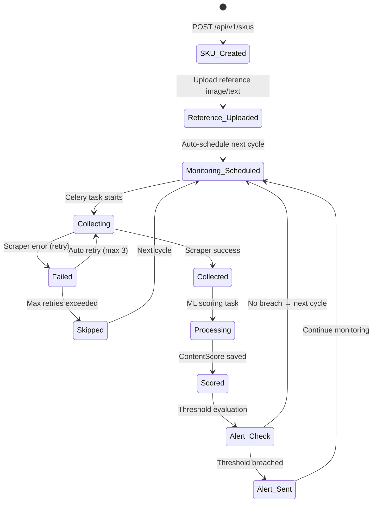

# Pseudocode — Commerce Analytics Tool (CAT)

> **SPARC Phase 4: Pseudocode** | Algorithms, Data Flow, API Contracts

---

## 1. Core Data Structures

```typescript
type UUID = string

type Organization = {
    id: UUID
    name: string
    slug: string
    plan: "basic" | "professional" | "enterprise"
    created_at: Timestamp
}

type SKU = {
    id: UUID
    org_id: UUID
    brand_id: UUID
    article: string
    rpc: string                     // retail product code
    name: string
    barcode: string
    category: string
    reference_image_url: string     // S3 URL of brand's reference image
    reference_description: string   // brand's canonical description
    reference_composition: string   // brand's canonical composition
    is_active: boolean
}

type Platform = {
    id: UUID
    name: string                    // "Wildberries", "Samokat_APP", etc.
    type: "marketplace" | "darkstore" | "retailer"
    scraper_module: string
    schedule_cron: string
}

type ContentScore = {
    id: UUID
    sku_id: UUID
    platform_id: UUID
    scored_at: Date
    content_total: number           // 0-100%
    image_front: number             // 0-100% (image similarity)
    description_score: number       // 0-100% (text similarity)
    composition_score: number       // 0-100% (composition match)
    collected_image_url: string     // S3 URL of scraped image
}

type StockSnapshot = {
    id: UUID
    sku_id: UUID
    platform_id: UUID
    date: Date
    city: string
    store_address: string
    address_id: string
    stock_count: number             // units in stock
    week_number: number
}

type DistributionPlan = {
    sku_id: UUID
    platform_id: UUID
    group_name: string              // "Фреш", "МКИ", "Заморозка"
    plan_tt_count: number           // planned store count
    week_number: number
    year: number
}

type Review = {
    id: UUID
    sku_id: UUID
    platform_id: UUID
    review_text: string
    rating: 1 | 2 | 3 | 4 | 5
    sentiment: "positive" | "negative" | "neutral"
    sentiment_score: number         // 0.0-1.0
    review_date: Date
    external_review_id: string
}

type PriceSnapshot = {
    id: UUID
    sku_id: UUID
    platform_id: UUID
    price: number
    original_price: number
    discount_pct: number
    promo_label: string
    collected_at: Timestamp
}

type AlertEvent = {
    id: UUID
    config_id: UUID
    sku_id: UUID
    platform_id: UUID
    alert_type: "content_drop" | "price_change" | "competitor_promo" | "oos"
    value_before: number
    value_after: number
    triggered_at: Timestamp
    is_sent: boolean
}
```

---

## 2. Core Algorithms

### Algorithm 1: Content Scoring

```
INPUT:
    sku: SKU
    platform: Platform
    collected_data: {image_url, description, composition}

OUTPUT:
    ContentScore

ALGORITHM:

STEP 1: Prepare embeddings for reference (cached or compute)
    IF sku.reference_image_embedding is in cache:
        ref_img_emb = cache.get(f"ref_img_{sku.id}")
    ELSE:
        ref_img = download_image(sku.reference_image_url)
        ref_img_emb = CLIP.encode_image(ref_img)
        cache.set(f"ref_img_{sku.id}", ref_img_emb, ttl=86400)

    IF sku.reference_text_embedding is in cache:
        ref_desc_emb = cache.get(f"ref_desc_{sku.id}")
        ref_comp_emb = cache.get(f"ref_comp_{sku.id}")
    ELSE:
        ref_desc_emb = E5.encode(sku.reference_description)
        ref_comp_emb = E5.encode(sku.reference_composition)
        cache.set(f"ref_desc_{sku.id}", ref_desc_emb, ttl=86400)
        cache.set(f"ref_comp_{sku.id}", ref_comp_emb, ttl=86400)

STEP 2: Compute collected embeddings
    collected_img = download_image(collected_data.image_url)
    col_img_emb = CLIP.encode_image(collected_img)
    col_desc_emb = E5.encode(collected_data.description)
    col_comp_emb = E5.encode(collected_data.composition)

STEP 3: Compute cosine similarities
    image_sim = cosine_similarity(ref_img_emb, col_img_emb)    // -1 to 1
    desc_sim = cosine_similarity(ref_desc_emb, col_desc_emb)
    comp_sim = cosine_similarity(ref_comp_emb, col_comp_emb)

STEP 4: Normalize to 0-100 scale
    image_score = (image_sim + 1) / 2 * 100      // convert -1..1 → 0..100
    desc_score = (desc_sim + 1) / 2 * 100
    comp_score = (comp_sim + 1) / 2 * 100

STEP 5: Compute weighted total
    content_total = 0.40 × image_score + 0.35 × desc_score + 0.25 × comp_score

STEP 6: Handle edge cases
    IF sku.reference_image_url is NULL:
        image_score = NULL
        content_total = 0.50 × desc_score + 0.50 × comp_score
    IF collected_data.description is NULL or empty:
        desc_score = 0

STEP 7: Save and return
    score = ContentScore{
        sku_id: sku.id,
        platform_id: platform.id,
        scored_at: TODAY(),
        content_total: round(content_total, 2),
        image_front: round(image_score, 2),
        description_score: round(desc_score, 2),
        composition_score: round(comp_score, 2),
        collected_image_url: collected_data.image_url
    }
    db.upsert(score, conflict_on=[sku_id, platform_id, scored_at])
    RETURN score

COMPLEXITY: O(1) per SKU (embedding computation is constant size)
```

---

### Algorithm 2: Distribution Plan vs Fact

```
INPUT:
    org_id: UUID
    week_number: int
    year: int

OUTPUT:
    DistributionReport[]

ALGORITHM:

STEP 1: Load distribution plan
    plans = db.query("""
        SELECT sku_id, platform_id, group_name, plan_tt_count
        FROM distribution_plans
        WHERE org_id = ? AND week_number = ? AND year = ?
    """, org_id, week_number, year)

STEP 2: Load actual stock data for the week
    actuals = db.query("""
        SELECT sku_id, platform_id, COUNT(DISTINCT address_id) as actual_tt_count
        FROM stock_history
        WHERE org_id = ? AND week_number = ? AND year = ?
          AND stock_count > 0
        GROUP BY sku_id, platform_id
    """, org_id, week_number, year)

    actuals_map = {(row.sku_id, row.platform_id): row.actual_tt_count
                   for row in actuals}

STEP 3: Compute distribution percentage
    results = []
    FOR plan in plans:
        actual_count = actuals_map.get((plan.sku_id, plan.platform_id), 0)
        IF plan.plan_tt_count > 0:
            distribution_pct = (actual_count / plan.plan_tt_count) * 100
        ELSE:
            distribution_pct = NULL

        results.append({
            platform: plan.platform_id,
            group: plan.group_name,
            sku: plan.sku_id,
            plan_tt: plan.plan_tt_count,
            fact_tt: actual_count,
            distribution_pct: round(distribution_pct, 1)
        })

STEP 4: Sort by distribution_pct ascending (worst first)
    results.sort(by=lambda r: r.distribution_pct or -1)

RETURN results
```

---

### Algorithm 3: Alert Detection

```
INPUT:
    check_time: Timestamp

OUTPUT:
    AlertEvent[] (new alerts to send)

ALGORITHM:

STEP 1: Load active alert configs
    configs = db.query("""
        SELECT * FROM alert_configs WHERE is_active = true
    """)

STEP 2: For each config, check condition
    new_alerts = []

    FOR config in configs:

        IF config.alert_type == "content_drop":
            // Check if content score dropped below threshold
            current_scores = db.query("""
                SELECT cs.* FROM content_scores cs
                JOIN sku_platforms sp ON cs.sku_platform_id = sp.id
                WHERE sp.org_id = ? AND cs.scored_at = TODAY()
                  AND cs.content_total < ?
                  AND (? IS NULL OR sp.sku_id = ?)
                  AND (? IS NULL OR sp.platform_id = ?)
            """, config.org_id, config.threshold,
                config.sku_id, config.sku_id,
                config.platform_id, config.platform_id)

            FOR score in current_scores:
                IF NOT already_alerted(config.id, score.sku_platform_id, TODAY()):
                    prev_score = get_score_yesterday(score.sku_platform_id)
                    new_alerts.append(AlertEvent{
                        config_id: config.id,
                        sku_platform_id: score.sku_platform_id,
                        alert_type: "content_drop",
                        value_before: prev_score?.content_total,
                        value_after: score.content_total,
                        triggered_at: NOW()
                    })

        IF config.alert_type == "competitor_promo":
            // Check if competitor SKU got a discount
            recent_promos = db.query("""
                SELECT ps.* FROM price_snapshots ps
                JOIN sku_platforms sp ON ps.sku_platform_id = sp.id
                JOIN skus s ON sp.sku_id = s.id
                JOIN brands b ON s.brand_id = b.id
                WHERE b.type = 'competitor' AND b.org_id = ?
                  AND ps.discount_pct > ?
                  AND ps.collected_at > ?
            """, config.org_id, config.threshold,
                check_time - INTERVAL('4 hours'))

            FOR promo in recent_promos:
                IF NOT already_alerted(config.id, promo.sku_platform_id, NOW()):
                    new_alerts.append(AlertEvent{...})

        IF config.alert_type == "oos":
            // Out of stock detection
            oos_skus = detect_out_of_stock(config.org_id, config.platform_id)
            FOR sku in oos_skus:
                new_alerts.append(AlertEvent{alert_type: "oos", ...})

STEP 3: Batch save and trigger email sending
    db.bulk_insert(new_alerts)
    FOR alert in new_alerts:
        celery_task.delay("send_alert_email", alert.id)

RETURN new_alerts
```

---

### Algorithm 4: Excel Report Generation

```
INPUT:
    report_type: "content" | "stock" | "reviews"
    org_id: UUID
    date_from: Date
    date_to: Date
    filters: {brands, platforms}

OUTPUT:
    xlsx_bytes: bytes

ALGORITHM:

STEP 1: Load data
    IF report_type == "content":
        data = load_content_scores(org_id, date_from, date_to, filters)
    ELIF report_type == "stock":
        data = load_stock_distribution(org_id, date_from, date_to, filters)
    ELIF report_type == "reviews":
        data = load_reviews_summary(org_id, date_from, date_to, filters)

STEP 2: Create workbook using template structure
    wb = openpyxl.Workbook()

    IF report_type == "content":
        // Sheet 1: Total summary
        ws_total = wb.create_sheet("Total")
        headers = ["Магазин", "Content total", "Image:Front", "Description", "Composition"]
        ws_total.append(headers)
        FOR platform_summary in data.by_platform:
            ws_total.append([
                platform_summary.name,
                f"{platform_summary.content_total:.0f}",
                f"{platform_summary.image_front:.0f}",
                f"{platform_summary.description:.0f}",
                f"{platform_summary.composition:.0f}"
            ])
            apply_styling(ws_total, color_code_scores=True)

        // Sheet 2: Score card (per SKU)
        ws_cards = wb.create_sheet("Score card")
        headers = ["Магазин", "Бренд", "Артикул", "RPC", "Название продукта",
                   "Ссылка", "Картинка", "Эталонная картинка",
                   "Content total", "Image:Front", "Description", "Composition"]
        ws_cards.append(headers)
        FOR score in data.scores:
            ws_cards.append([
                score.platform_name, score.brand_name, score.article,
                score.rpc, score.sku_name, score.url,
                score.collected_image_url, score.reference_image_url,
                score.content_total, score.image_front,
                score.description_score, score.composition_score
            ])

        // Add explanation row (as in template)
        ws_cards.append([])
        ws_cards.append(["Пояснение по метрикам"])
        ws_cards.append(["Content total - общее соответствие контента карточки требованиям клиента"])
        // ... other explanations

    IF report_type == "stock":
        // Create all 7 sheets matching Stock Report.xlsx template
        create_sheet_plan_fact_by_network(wb, data)
        create_sheet_all_skus(wb, data)
        create_sheet_sku_by_city(wb, data)
        create_sheet_share_by_city(wb, data)
        create_sheet_sku_by_address(wb, data)
        create_sheet_plan_fact_top_cities(wb, data)
        create_sheet_sku_per_tt(wb, data)

    IF report_type == "reviews":
        // Create 4 sheets matching Reviews Report.xlsx template
        create_sheet_summary(wb, data)
        create_sheet_total_by_brand(wb, data)
        create_sheet_total_by_brand_category(wb, data)
        create_sheet_review_texts(wb, data)

STEP 3: Apply styles
    FOR ws in wb.worksheets:
        apply_header_style(ws.row(1))    // bold, background color
        apply_data_styles(ws)            // font, borders
        auto_fit_columns(ws)

STEP 4: Serialize and return
    buffer = BytesIO()
    wb.save(buffer)
    buffer.seek(0)
    RETURN buffer.getvalue()

COMPLEXITY: O(n × m) where n = SKU count, m = platform count
```

---

### Algorithm 5: Sentiment Analysis (Reviews)

```
INPUT:
    reviews: Review[]

OUTPUT:
    SentimentResult[]

ALGORITHM:

STEP 1: Batch preprocessing
    texts = [r.review_text for r in reviews]
    batch_size = 32

STEP 2: Batch encode with ruBERT sentiment model
    results = []
    FOR batch in chunks(texts, batch_size):
        // Model returns: [{"label": "positive", "score": 0.94}, ...]
        predictions = sentiment_model.predict(batch)
        results.extend(predictions)

STEP 3: Map to Review entities
    FOR i, review in enumerate(reviews):
        pred = results[i]
        review.sentiment = pred.label          // positive/negative/neutral
        review.sentiment_score = pred.score    // confidence 0.0-1.0
        db.update(review)

STEP 4: Aggregate by brand/category
    FOR each (brand, category) combination:
        brand_reviews = [r for r in reviews if r.brand == brand and r.category == category]
        total = len(brand_reviews)
        positive_count = len([r for r in brand_reviews if r.sentiment == "positive"])
        negative_count = len([r for r in brand_reviews if r.sentiment == "negative"])

        save_aggregate({
            brand: brand,
            category: category,
            total_reviews: total,
            positive_share: positive_count / total,
            negative_share: negative_count / total,
            period: CURRENT_WEEK
        })

COMPLEXITY: O(n / batch_size × model_inference_time)
Estimated: 1000 reviews / 32 × 100ms = ~3 seconds
```

---

## 3. API Contracts

### POST /api/v1/auth/login

```
Request:
  Content-Type: application/json
  Body: {
    "email": "manager@brand.ru",
    "password": "secret"
  }

Response 200:
  {
    "access_token": "eyJhbGc...",
    "refresh_token": "dGhpcyB...",
    "token_type": "Bearer",
    "expires_in": 3600,
    "user": {
      "id": "uuid",
      "email": "manager@brand.ru",
      "role": "manager",
      "org_id": "uuid",
      "org_name": "ИндиЛайт"
    }
  }

Response 401:
  { "detail": "INVALID_CREDENTIALS" }
```

### GET /api/v1/content/scores

```
Request:
  Headers: { Authorization: Bearer <token> }
  Query: ?brand_id=uuid&platform_id=uuid&date_from=2025-03-01&date_to=2025-03-17&limit=100&offset=0

Response 200:
  {
    "total": 247,
    "items": [
      {
        "sku_id": "uuid",
        "sku_name": "Индейка Индилайт Духовая охлажденная 400г",
        "article": "3927",
        "platform_name": "Samokat_APP",
        "scored_at": "2025-03-17",
        "content_total": 63.5,
        "image_front": 72.1,
        "description_score": 58.3,
        "composition_score": 60.0,
        "url": "https://samokat.ru/product/...",
        "collected_image_url": "https://minio.cat.ru/collected/...",
        "reference_image_url": "https://minio.cat.ru/reference/..."
      }
    ],
    "summary": {
      "avg_content_total": 68.4,
      "below_threshold_count": 12,
      "threshold": 70
    }
  }
```

### POST /api/v1/reports/export

```
Request:
  Headers: { Authorization: Bearer <token> }
  Body: {
    "report_type": "content",
    "date_from": "2025-03-10",
    "date_to": "2025-03-17",
    "brand_ids": ["uuid1", "uuid2"],
    "platform_ids": ["uuid1"]
  }

Response 200:
  Content-Type: application/vnd.openxmlformats-officedocument.spreadsheetml.sheet
  Content-Disposition: attachment; filename="Content_Report_2025-03-17.xlsx"
  Body: <binary xlsx content>

Response 400:
  { "detail": "INVALID_DATE_RANGE" }
Response 403:
  { "detail": "REPORT_EXPORT_NOT_ALLOWED_ON_BASIC_PLAN" }
```

---

## 4. State Transitions



---

## 5. Error Handling Strategy

| Error Category | HTTP Code | Response | Retry |
|---------------|-----------|----------|-------|
| Invalid auth | 401 | `UNAUTHORIZED` | No |
| Insufficient permissions | 403 | `FORBIDDEN` | No |
| SKU not found | 404 | `SKU_NOT_FOUND` | No |
| Validation error | 422 | Field-level errors | No |
| Scraper blocked | — | Log + alert admin | Yes (proxy rotate) |
| ML model error | — | Log + fallback score NULL | No |
| DB connection | 503 | `SERVICE_UNAVAILABLE` | Yes (exponential) |
| Rate limit hit | 429 | `RATE_LIMIT_EXCEEDED` | Yes (wait) |
