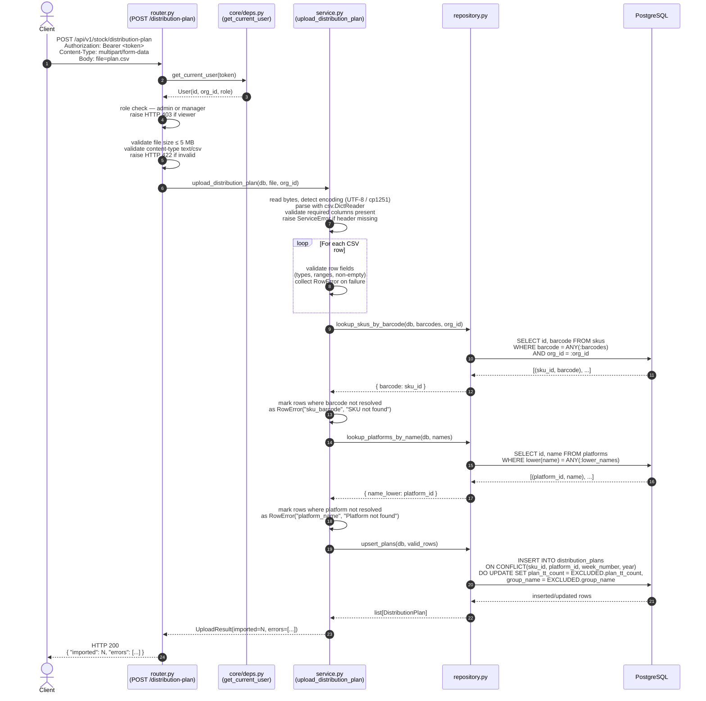

# Architecture: stock-plan-upload

**Feature:** Distribution Plan Upload (CSV → distribution_plans table)
**Service:** `services/api/app/stock/`
**Status:** Design — Sprint 4

---

## 1. Position in the Overall Architecture

```
services/api/
└── app/
    ├── core/            # config, database, deps, security  ← shared
    ├── auth/            # User model, JWT                   ← shared
    ├── catalog/         # SKU, Platform, Brand models       ← shared (read-only from stock/)
    └── stock/           # ← THIS FEATURE
        ├── models.py
        ├── schemas.py
        ├── repository.py
        ├── service.py
        └── router.py
```

`stock/` is a self-contained domain module. It imports from `app.core` and
`app.catalog.models` (read-only) — never from `app.auth` directly (user context
arrives via dependency injection from `app.core.deps`).

The module is mounted at `/api/v1/stock` in `app/main.py`.

---

## 2. File Structure

### `models.py`

Declares the `DistributionPlan` SQLAlchemy ORM model, which maps to the
pre-existing `distribution_plans` table. No `org_id` column exists on the table;
tenant isolation is achieved exclusively through a `JOIN` to `skus.org_id`.

```
DistributionPlan
    id               UUID  PK
    sku_id           UUID  FK → skus.id
    platform_id      UUID  FK → platforms.id
    group_name       VARCHAR(100)
    plan_tt_count    INTEGER
    week_number      INTEGER
    year             INTEGER
    UNIQUE(sku_id, platform_id, week_number, year)
```

No additional columns are added; the migration only adds a covering index
(see Section 6).

### `schemas.py`

Pydantic v2 schemas for request/response validation:

| Schema | Direction | Purpose |
|---|---|---|
| `DistributionPlanUploadResponse` | Response | `{ imported: int, errors: list[RowError] }` |
| `RowError` | Embedded | `{ row: int, field: str, message: str }` |
| `DistributionPlanRow` | Response | Single plan row for GET listing |
| `DistributionPlanPage` | Response | `{ items: list[DistributionPlanRow], total: int, page: int, size: int }` |
| `PlanFilters` | Query params | `platform_id?, week_number?, year?` |

### `repository.py`

All DB access. Accepts `AsyncSession` injected from the caller.
**All queries that touch `distribution_plans` must JOIN through `skus` on
`skus.org_id = :org_id`.**

Methods (async):

| Method | Signature | Notes |
|---|---|---|
| `upsert_plans` | `(db, rows: list[dict]) → list[DistributionPlan]` | Batch INSERT … ON CONFLICT DO UPDATE |
| `list_plans` | `(db, org_id, filters, page, size) → tuple[list, int]` | Paginated; returns `(items, total)` |
| `delete_plan` | `(db, plan_id, org_id) → bool` | Verifies org ownership via JOIN before delete |
| `lookup_skus_by_barcode` | `(db, barcodes: list[str], org_id) → dict[str, UUID]` | Batch; returns `{ barcode: sku_id }` |
| `lookup_platforms_by_name` | `(db, names: list[str]) → dict[str, UUID]` | Case-insensitive; platforms are global |

### `service.py`

Business logic. No SQLAlchemy sessions directly — receives `db: AsyncSession`
as a parameter and delegates all I/O to `repository.py`.

| Function | Responsibility |
|---|---|
| `upload_distribution_plan` | Parse CSV, validate rows, resolve lookups, call upsert, return result |
| `list_distribution_plans` | Apply filters, delegate to repo, return page |
| `delete_distribution_plan` | Authorize by org, delegate to repo |

### `router.py`

Thin HTTP layer — input/output validation via Pydantic, maps domain exceptions
to `HTTPException`. Delegates immediately to `service.py`.

| Endpoint | Auth | Role |
|---|---|---|
| `POST /api/v1/stock/distribution-plan` | Bearer JWT | admin, manager |
| `GET  /api/v1/stock/distribution-plan` | Bearer JWT | admin, manager, viewer |
| `DELETE /api/v1/stock/distribution-plan/{id}` | Bearer JWT | admin, manager |

---

## 3. Sequence Diagram — POST /distribution-plan



---

## 4. DB Interactions

All database access flows exclusively through `repository.py`. The service layer
never imports `AsyncSession` directly from `core.database` — it receives the
session as a dependency argument.

### Key query patterns

**Batch SKU lookup (tenant-scoped):**
```sql
SELECT id, barcode
FROM skus
WHERE barcode = ANY(:barcodes)
  AND org_id = :org_id
  AND is_active = TRUE;
```

**Batch platform lookup (global catalog):**
```sql
SELECT id, name
FROM platforms
WHERE lower(name) = ANY(:lower_names);
```

**UPSERT distribution plans:**
```sql
INSERT INTO distribution_plans
    (id, sku_id, platform_id, group_name, plan_tt_count, week_number, year)
VALUES
    (:id, :sku_id, :platform_id, :group_name, :plan_tt_count, :week_number, :year)
ON CONFLICT (sku_id, platform_id, week_number, year)
DO UPDATE SET
    plan_tt_count = EXCLUDED.plan_tt_count,
    group_name    = EXCLUDED.group_name;
```

**Paginated list (tenant-scoped via JOIN):**
```sql
SELECT dp.*
FROM distribution_plans dp
JOIN skus s ON s.id = dp.sku_id
WHERE s.org_id = :org_id
  AND (:platform_id IS NULL OR dp.platform_id = :platform_id)
  AND (:week_number IS NULL OR dp.week_number = :week_number)
  AND (:year IS NULL      OR dp.year = :year)
ORDER BY dp.year DESC, dp.week_number DESC
LIMIT :size OFFSET :offset;
```

**Secure delete (verify org ownership before deleting):**
```sql
DELETE FROM distribution_plans
WHERE id = :plan_id
  AND sku_id IN (
      SELECT id FROM skus WHERE org_id = :org_id
  );
```

---

## 5. Tenant Isolation Pattern

The `distribution_plans` table has **no `org_id` column**. Tenant isolation is
enforced by always joining through `skus`:

```
distribution_plans.sku_id → skus.id → skus.org_id
```

**Rules (mandatory for every query in `repository.py`):**

1. `READ` — always `JOIN skus ON skus.id = dp.sku_id WHERE skus.org_id = :org_id`
2. `WRITE` — before insert, verify that `sku_id` belongs to the org via the
   `lookup_skus_by_barcode` step in the service; never accept a raw `sku_id`
   from the client
3. `DELETE` — use a subquery `WHERE sku_id IN (SELECT id FROM skus WHERE org_id = :org_id)`
4. `UPSERT` — only pre-validated `sku_id` values (resolved in step 2 above) are
   inserted, so org ownership is implicitly guaranteed

PostgreSQL RLS on `distribution_plans` (if configured) must also check
`sku_id IN (SELECT id FROM skus WHERE org_id = current_setting('app.org_id')::uuid)`
as a backstop.

---

## 6. Alembic Migration

The `distribution_plans` table already exists. The migration adds a covering
index to support efficient tenant-scoped queries (the JOIN path
`distribution_plans.sku_id → skus.org_id` is traversed on every read).

**Migration file:** `infrastructure/postgres/alembic/versions/XXXX_stock_plan_upload_index.py`

```python
"""add covering index for distribution_plans tenant queries

Revision ID: <auto>
Down revision: <previous>
"""

from alembic import op

def upgrade() -> None:
    # Covering index: accelerates JOIN distribution_plans → skus on org_id scans
    # and single-platform / single-week filter queries.
    op.create_index(
        "idx_distribution_plans_sku_platform_week",
        "distribution_plans",
        ["sku_id", "platform_id", "week_number", "year"],
        unique=False,
    )

def downgrade() -> None:
    op.drop_index(
        "idx_distribution_plans_sku_platform_week",
        table_name="distribution_plans",
    )
```

> Note: The UNIQUE constraint `(sku_id, platform_id, week_number, year)` is
> already present on the table (used by UPSERT). The new index above is a
> non-unique covering index for read performance on filtered list queries.
> If the existing UNIQUE constraint already creates a B-tree index that covers
> these columns in the same order, this migration may be skipped — verify
> with `\d distribution_plans` in psql.

---

## 7. Error Handling Strategy

| Layer | Error Type | HTTP Code |
|---|---|---|
| Router | File too large | 422 |
| Router | Wrong content-type | 422 |
| Router | Role insufficient | 403 |
| Service | Missing CSV header columns | 422 |
| Service | CSV parse failure | 422 |
| Service (row-level) | Invalid field type / range | 200 + `errors[]` |
| Service (row-level) | SKU barcode not found in org | 200 + `errors[]` |
| Service (row-level) | Platform name not found | 200 + `errors[]` |
| Repository | DB integrity violation | 500 (logged, not exposed) |

Row-level errors do NOT abort the entire import. Valid rows are imported;
invalid rows are reported in the `errors` array of the response. This allows
partial imports, which is the expected UX for bulk CSV tools.

---

## 8. Dependencies

| Module | Import | Reason |
|---|---|---|
| `app.core.deps` | `get_db`, `get_current_user`, `require_role` | Auth + DB session |
| `app.catalog.models` | `SKU`, `Platform` | Barcode/name resolution queries |
| `app.core.database` | `Base` | ORM declarative base for `DistributionPlan` |
| `fastapi` | `UploadFile`, `APIRouter`, `Depends` | HTTP layer |
| `sqlalchemy.ext.asyncio` | `AsyncSession` | Async DB access |
| `csv`, `io`, `chardet` | stdlib / chardet | CSV parsing with encoding detection |
