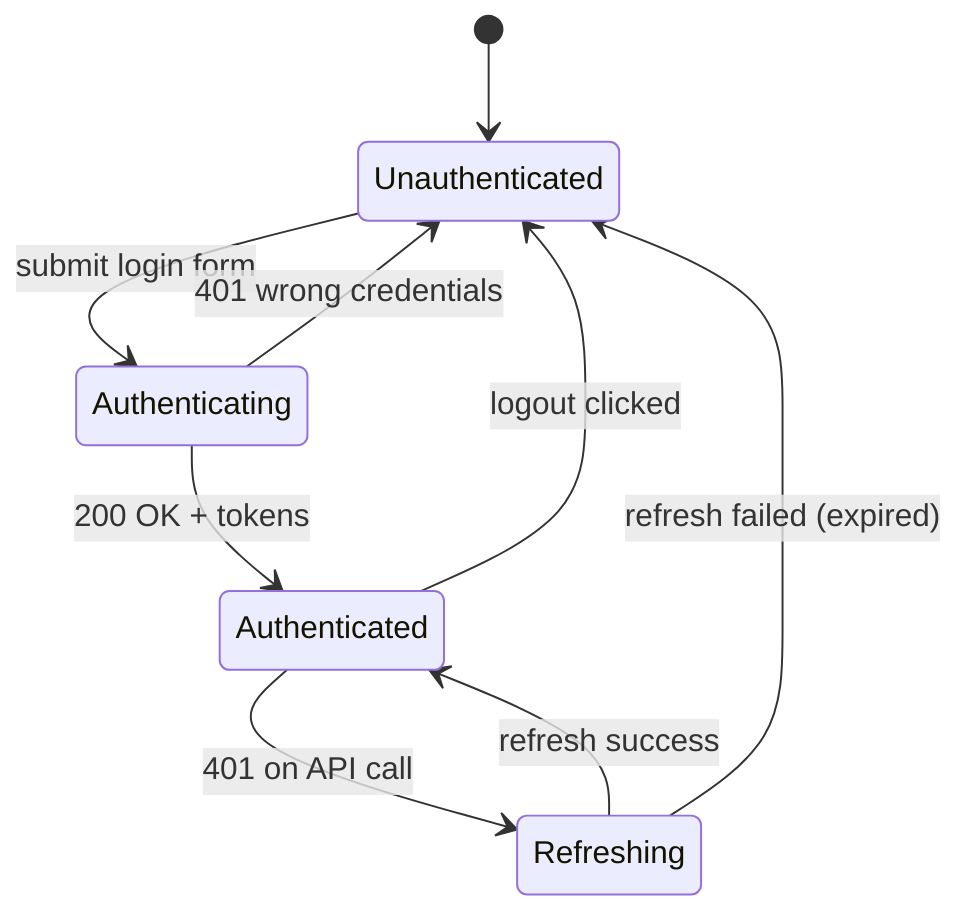

# Pseudocode — Web Dashboard
> Feature: web-dashboard | SPARC Phase 4 | CAT Project

---

## 1. Data Structures (TypeScript)

```typescript
// types/api.ts
type UUID = string

interface PaginatedResponse<T> {
  items: T[]
  total: number
  page: number
  page_size: number
}

// types/content.ts
interface ContentScore {
  id: UUID
  sku_id: UUID
  sku_name: string
  article: string
  brand_name: string
  platform_id: UUID
  platform_name: string
  platform_url: string
  content_total: number        // 0-100
  image_front: number
  description_score: number
  composition_score: number
  collected_image_url: string | null
  collected_description: string | null
  scored_at: string            // ISO date
}

interface ContentDrilldown extends ContentScore {
  reference_image_url: string | null
  reference_description: string | null
  reference_composition: string | null
  history: { date: string; content_total: number }[]
}

// types/stock.ts
interface DistributionRow {
  sku_id: UUID
  sku_name: string
  brand_name: string
  platform_name: string
  group_name: string
  plan_tt_count: number
  fact_tt_count: number
  coverage_pct: number         // fact / plan * 100
  week_number: number
  year: number
}

// types/prices.ts
interface PriceRow {
  sku_id: UUID
  sku_name: string
  platform_name: string
  current_price: number
  original_price: number
  discount_pct: number
  promo_label: string | null
  collected_at: string
  delta_7d_pct: number | null  // % change vs 7 days ago
}

// types/reviews.ts
interface ReviewRow {
  id: UUID
  sku_name: string
  platform_name: string
  rating: 1 | 2 | 3 | 4 | 5
  sentiment: 'positive' | 'negative' | 'neutral'
  sentiment_score: number
  review_text: string
  review_date: string
}

interface SentimentSummary {
  brand_name: string
  positive_pct: number
  negative_pct: number
  neutral_pct: number
  total_reviews: number
}

// types/alerts.ts
interface AlertEvent {
  id: UUID
  alert_type: 'content_drop' | 'price_change' | 'competitor_promo' | 'oos'
  sku_name: string
  platform_name: string
  value_before: number
  value_after: number
  triggered_at: string
  is_acknowledged: boolean
}

// store/authStore.ts
interface AuthState {
  user: { id: UUID; email: string; role: 'admin' | 'manager' | 'viewer'; org_id: UUID } | null
  accessToken: string | null
  setAuth: (user: AuthState['user'], token: string) => void
  clearAuth: () => void
}
```

---

## 2. Core Algorithms

### Algorithm: JWT Token Refresh (Race Condition Safe)

```
INPUT: failed request config (axios error), refreshToken from sessionStorage
OUTPUT: new accessToken OR redirect to /login

GLOBAL: refreshPromise = null

FUNCTION handleTokenRefresh(error):
  IF error.status != 401 OR error.config._retry:
    RETURN reject(error)

  IF refreshPromise IS null:
    refreshPromise = POST /api/v1/auth/refresh { refresh_token }
      .then(res → store new accessToken in Zustand)
      .catch(err →
        clearAuth()
        navigate('/login')
        throw err
      )
      .finally(() → refreshPromise = null)

  newToken = AWAIT refreshPromise
  error.config._retry = true
  error.config.headers.Authorization = "Bearer " + newToken
  RETURN retry(error.config)

COMPLEXITY: O(1) concurrent requests all wait on single refresh promise
```

---

### Algorithm: Content Score Color Coding

```
INPUT: score: number (0-100)
OUTPUT: { bg: string, text: string, label: string }

FUNCTION getScoreStyle(score):
  IF score >= 80:
    RETURN { bg: '#f6ffed', text: '#52c41a', label: 'green' }
  ELSE IF score >= 50:
    RETURN { bg: '#fffbe6', text: '#faad14', label: 'yellow' }
  ELSE:
    RETURN { bg: '#fff2f0', text: '#ff4d4f', label: 'red' }

CONSTANTS:
  SCORE_GREEN_THRESHOLD = 80
  SCORE_YELLOW_THRESHOLD = 50
```

---

### Algorithm: Distribution Heatmap Data Transformation

```
INPUT: rows: DistributionRow[]
OUTPUT: ECharts heatmap series data

FUNCTION buildHeatmapData(rows):
  platforms = unique(rows.map(r → r.platform_name)).sort()
  weeks = unique(rows.map(r → r.week_number)).sort()

  data = []
  FOR each row IN rows:
    x = weeks.indexOf(row.week_number)
    y = platforms.indexOf(row.platform_name)
    value = row.coverage_pct
    data.push([x, y, value])

  RETURN {
    xAxis: weeks.map(w → "W" + w),
    yAxis: platforms,
    series: [{ type: 'heatmap', data }]
  }

COMPLEXITY: O(n) where n = number of distribution rows
```

---

### Algorithm: Filter State → Query Params

```
INPUT: filters: Record<string, any>
OUTPUT: URLSearchParams

FUNCTION filtersToParams(filters):
  params = new URLSearchParams()
  FOR key, value IN filters:
    IF value IS null OR value IS undefined:
      CONTINUE
    IF value IS Array:
      FOR each item IN value:
        params.append(key, item)
    ELSE IF value IS Date:
      params.set(key, formatISO(value, 'date'))
    ELSE:
      params.set(key, String(value))
  RETURN params

// Used for: URL persistence + API call params (same object)
```

---

## 3. API Contracts

### GET /api/v1/content/scores

```
Request:
  Headers: { Authorization: Bearer <token> }
  Query:
    platform_id?: UUID
    brand_id?: UUID
    score_max?: number
    score_min?: number
    date?: string (YYYY-MM-DD)
    page?: number (default: 1)
    page_size?: number (default: 50)

Response (200):
  {
    items: ContentScore[],
    total: number,
    page: number,
    page_size: number
  }

Response (401): { detail: "Not authenticated" }
Response (403): { detail: "Forbidden" }
```

### GET /api/v1/content/scores/{sku_platform_id}/drilldown

```
Response (200): ContentDrilldown
Response (404): { detail: "Not found" }
```

### GET /api/v1/stock/distribution

```
Query: week?: number, year?: number, platform_id?: UUID, brand_id?: UUID, group?: string
Response (200): { items: DistributionRow[], total: number, ... }
```

### GET /api/v1/prices

```
Query: platform_id?: UUID, anomaly_only?: boolean, page?, page_size?
Response (200): { items: PriceRow[], ... }
```

### GET /api/v1/reviews/sentiment

```
Query: platform_id?: UUID, date_from?: string, date_to?: string
Response (200): { items: SentimentSummary[], period: { from, to } }
```

### GET /api/v1/reviews

```
Query: sentiment?: string, rating?: number, platform_id?, page?, page_size?
Response (200): { items: ReviewRow[], total, ... }
```

### GET /api/v1/alerts

```
Query: alert_type?: string, acknowledged?: boolean, page?, page_size?
Response (200): { items: AlertEvent[], total, ... }
```

### PATCH /api/v1/alerts/{id}/acknowledge

```
Response (200): AlertEvent (updated)
Response (404): { detail: "Not found" }
```

### GET /api/v1/dashboard/summary

```
Response (200):
  {
    avg_content_score: number,
    active_alerts_count: number,
    distribution_coverage_pct: number,
    monitored_sku_count: number,
    trends: {
      content_score_7d_delta: number,
      alerts_7d_delta: number,
      distribution_7d_delta: number
    },
    red_zone: ContentScore[5],    // top-5 lowest
    recent_alerts: AlertEvent[5]
  }
```

### POST /api/v1/reports/content-export

```
Body: { date?: string, platform_ids?: UUID[] }
Response (200): application/vnd.openxmlformats-officedocument.spreadsheetml.sheet
Content-Disposition: attachment; filename="content_scores_YYYYMMDD.xlsx"
```

---

## 4. State Transitions — Authentication



---

## 5. Error Handling Strategy

| Error | UI Behavior |
|-------|-------------|
| 401 Unauthorized | Auto-refresh → retry. If refresh fails → redirect /login |
| 403 Forbidden | Toast "Access denied" — do not redirect |
| 404 Not Found | Show empty state in component |
| 422 Validation | Show field-level errors from `detail` array |
| 500 Server Error | Toast "Server error, try again" + Sentry log |
| Network timeout | Toast "Connection problem" + retry button |
| Export download fail | Toast "Export failed" with retry |
